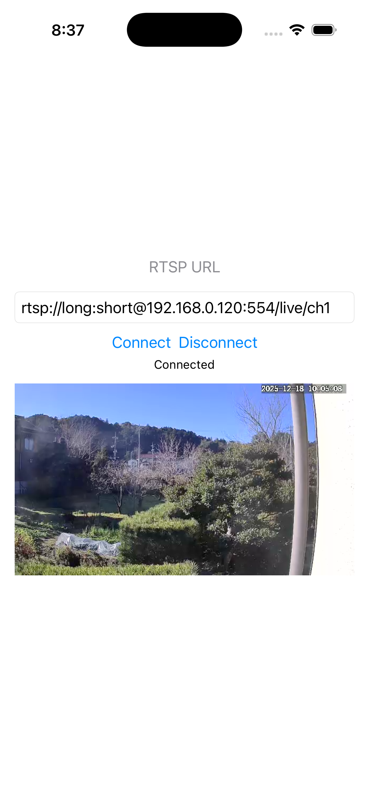

# Simple iOS RTSP Viewer

A lightweight RTSP viewer for iOS using SwiftUI, RTSP, RTP, and VideoToolbox (H.264).
No VLC. No ffmpeg.

## Features

- RTSP over TCP
- Digest authentication
- RTP H.264 (FU-A supported)
- VideoToolbox decoding
- Swift Concurrency (async/await)

## Connected Camera

- Jennov IP66

## Screenshot

